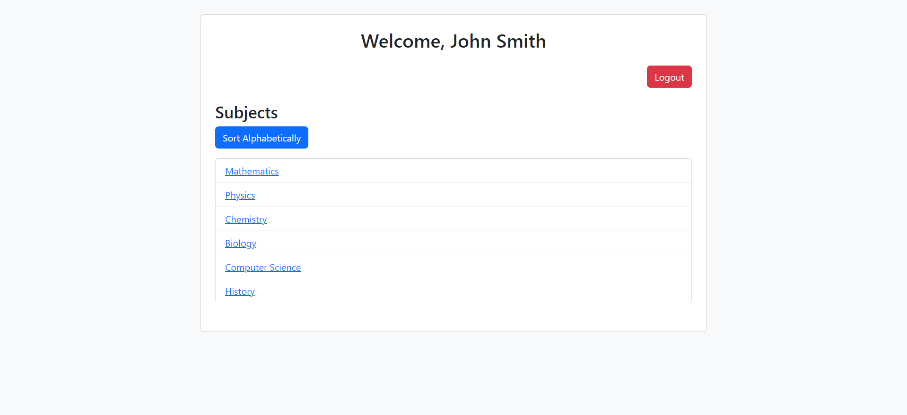
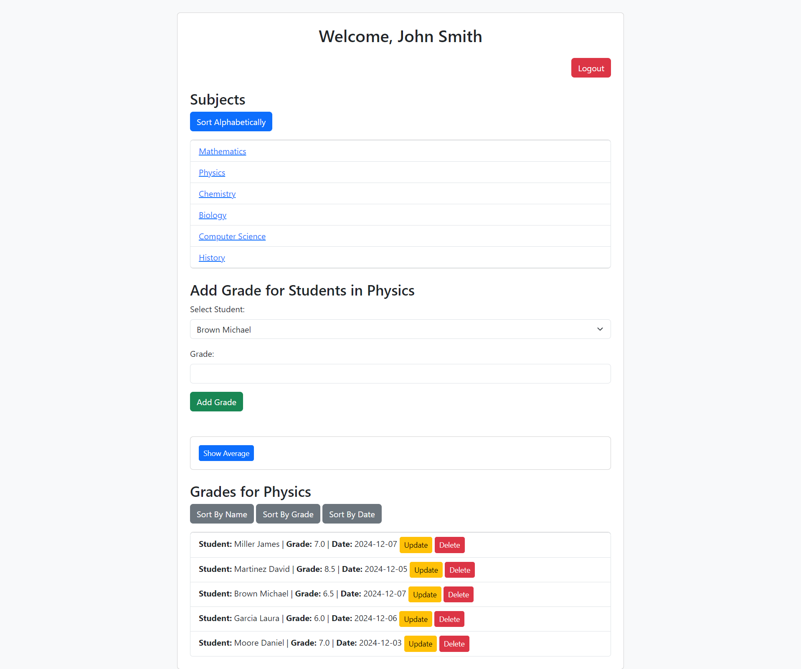
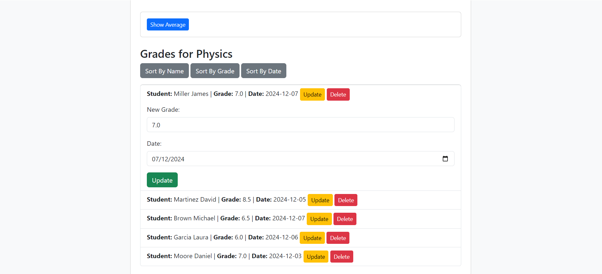
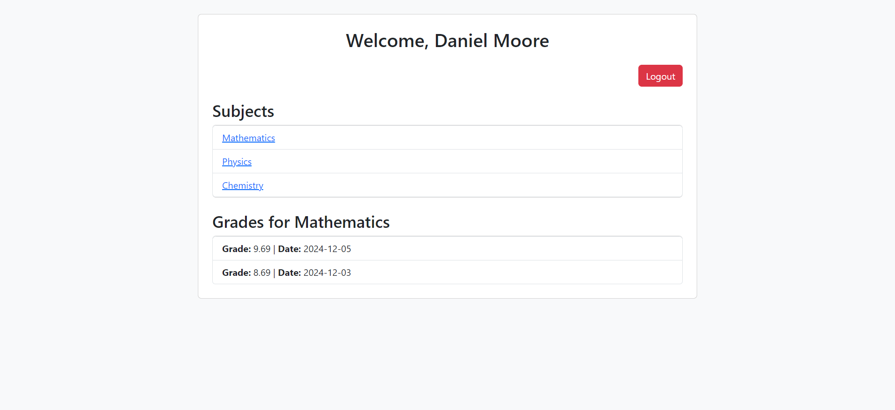

# TeacherHub - Teacher-Student Grade Management Platform

## Overview

TeacherHub is a web application designed to facilitate communication and grade management between teachers and students within an educational institution. Built using Java Servlets and JSP, it provides a secure platform for teachers to manage student grades and for students to view their academic performance.

**Key Features:**

* **Role-Based Access:**  Distinguishes between Teacher and Student roles based on email login.
* **Teacher-Centric Grade Management:** Empowers teachers to manage grades for their assigned subjects efficiently.
* **Student Grade Visibility:** Provides students with a clear and concise view of their grades in enrolled subjects.
* **Data Persistence:** Utilizes a SQL Server database to ensure persistent storage of subject and grade data.
* **Styled with Bootstrap:**  Offers a responsive and user-friendly interface thanks to Bootstrap styling.

## Features Breakdown

### Teacher Features

* **Subject Visualization:** Upon successful login, teachers can view a comprehensive list of all subjects available within the system.
* **Comprehensive Grade View:** Teachers can access and visualize all grades for every student across all subjects, providing a holistic view of student performance.
* **Grade Sorting & Filtering:**  Grades can be sorted by student name, grade value, or date of entry, enabling teachers to analyze data effectively.
* **Subject-Specific Grade Management:** Teachers can **add, delete, and update** grades *only* for the subjects they are specifically assigned to, ensuring data integrity and teacher responsibility.
* **Subject Average Grade Calculation:** The application automatically calculates and displays the average grade for each subject, providing teachers with quick performance insights for their assigned courses.
* **Read-Only Subject View (Unassigned Subjects):** For subjects a teacher is not assigned to, they can still view the subject details but cannot modify grades, maintaining system-wide subject visibility.

### Student Features

* **Enrolled Subject Visibility:** Students, upon login, can view a list of subjects they are currently enrolled in.
* **Personalized Grade View:** Students can access and view their grades specifically for the subjects they are enrolled in, allowing them to track their progress.
* **Read-Only Access:** Students have read-only access to their grades, ensuring data security and preventing unauthorized modifications.

## Technologies Used

* **Backend:**
    * Java Servlets
    * JSP (JavaServer Pages - for dynamic web page creation)
    * Java (Programming Language)
* **Database:**
    * Microsoft SQL Server (for persistent data storage)
    * Stored Procedures (for efficient database operations - CRUD operations)
* **Application Server:**
    * Apache Tomcat
* **Frontend:**
    * HTML
    * CSS
    * JavaScript
    * Bootstrap

## Setup

To run TeacherHub locally, please follow these steps:

1. **Prerequisites:**
    * **Java Development Kit (JDK):** Ensure you have JDK installed.
    * **Apache Tomcat Server:** Download and install Apache Tomcat.
    * **Microsoft SQL Server:** You will need access to a running SQL Server instance.
    * **SQL Server Management Studio (SSMS):** To execute the database setup script.

2. **Database Setup:**
    * **Run the SQL Script:**  Locate the SQL script file (`teacherhub_db_setup.sql`) in the project repository. Execute this script against the newly created database to create tables and stored procedures.

3. **Configure Database Connection:**
    * **Edit `db.properties`:** Open `db.properties` and add the following lines, replacing the placeholders with your actual SQL Server connection details:

      ```properties
      db.url=jdbc:sqlserver://[Your SQL Server Host]:[Port, e.g., 1433];databaseName=[Your Database Name]
      db.username=[Your SQL Server Username]
      db.password=[Your SQL Server Password]
      ```

## Usage

**Login:**

1. Open the TeacherHub application in your web browser.
2. You will be presented with a login page.
3. **Email-based Login:** Enter your email address.  *(Note: There is no registration.  Valid teacher/student emails need to be pre-configured in the database for login to work.)*
4. Click the "Login" button.

**Teacher Usage:**

1. **Subject List:** After successful login as a teacher, you will be directed to the Subject List page.
   

2. **View Grades for a Subject:** Click on a subject from the list to view the grades for all students in that subject.
   

4. **Edit Grades (for assigned subjects):** If you are assigned to a subject, you will see options to add, update, or delete grades for students in that subject.
   

**Student Usage:**

1. **Subject List & View Grades:** After successful login as a student, you will see a list of subjects you are enrolled in. Click on a subject to view your grades for that subject.
    

## Challenges and Learnings

During the development of TeacherHub, I encountered and overcame the following challenges, leading to valuable learning experiences:

* **Database Design and Stored Procedures:** Designing the database schema for efficient grade management and implementing CRUD operations using stored procedures enhanced my understanding of database optimization and security best practices.
* **Servlet-based Web Application Development:** Building the application using Java Servlets provided a deep dive into the Servlet lifecycle, request-response handling, and session management in Java web applications.
* **Role-Based Access Control:** Implementing the email-based role differentiation for teachers and students taught me about basic authorization principles in web applications.
* **Frontend Styling with Bootstrap:** Utilizing Bootstrap to style the application improved my skills in responsive web design and leveraging CSS frameworks for rapid UI development.